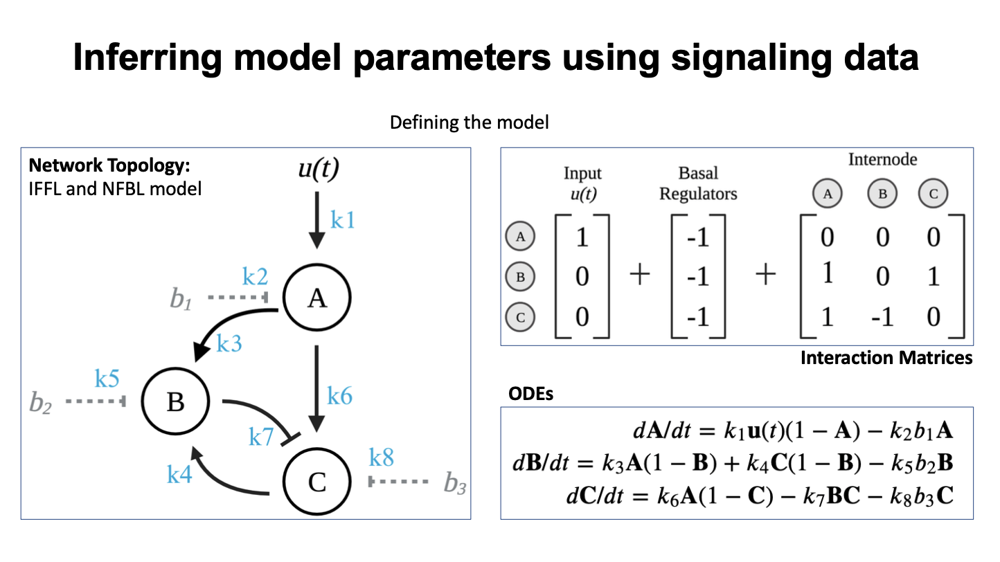
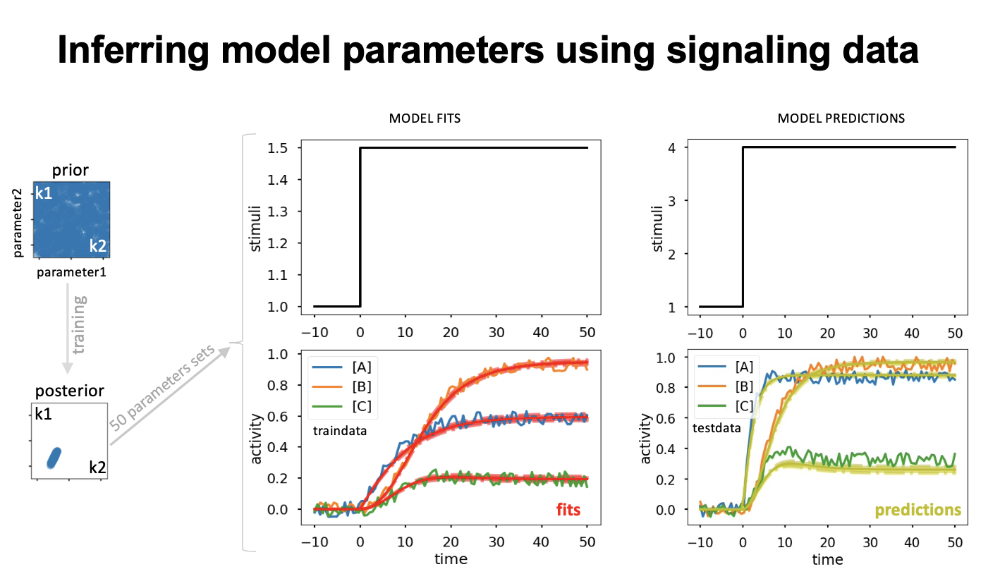

# Jashnsaz_STARProtocols_2021
core codes and data generated for Jashnsaz_STARProtocols_2021 and Jashnsaz_iScience_2020 

These codes are generated in MATLAB R2019a and includes the following: 

Jashnsaz_et_al_dir01_Models to generate the models and visualize them. 
Jashnsaz_et_al_dir02_simData to generate simulated data.  
Jashnsaz_et_al_dir03_FisherInformationMatrix to implement Fisher Information Matrix analysis. 
Jashnsaz_et_al_dir04_Bayesian to implement Bayesian analysis. 
Jashnsaz_et_al_dir05_MLEs to train the model with different training data conditions and to evaluate the model predictions 
Jashnsaz_et_al_dir06_GeneratePumpProfiles to set up and generate pump profiles for time-varying cell stimulations
Jashnsaz_et_al_dir07_CellGrowth to calculate the inoculation volumes for cell cultures

See README.txt in each directory for more details.

Jashnsaz_et_al_dir0_3node_model includes a jupyter notebook (Jashnsaz_et_al_3node_model.ipynb) to: 
- Set up ODE models for regulatory networks (a 3-node model here)
- Using the model and a set of parameters, simulate time-dependent signaling data
- Use the simulated data to estimate model parameters using a Bayesian optimization algorithm
- Visualize errors over the optimization iterations
- quantify the posterior and evaluate correlation among model parameters
- Evaluate model fits and predictions

